# Meridian Care Hospital: Phase 0 plan

Status: draft for your review. Everything here is a prototype. All data is fictional and every external integration is simulated and labelled "Simulated".
Companion files: `ASSUMPTIONS.md` (every assumption and unknown), `DEV_SETUP.md` (how to set up your machine).

---

## 1. Thesis

Meridian Care is a **revenue-cycle and patient-flow system**, not a general hospital management system. Every feature exists because it traces to one of the ten pain points (P1 to P10) in the brief. If a feature cannot be traced, it is not built. `PAIN_POINT_TRACEABILITY.md` (pain point, feature, screen, test) grows every phase and is finished in Phase 8.

---

## 2. Stack and versions

Versions below were read from the npm registry on 30 Sep 2026. They are the latest published, except where noted. Pin them exactly (`--save-exact`) so the project builds the same on your machine and mine.

| Area | Choice | Version | Note |
|---|---|---|---|
| Runtime | Node.js | 22 or newer | Mongoose 9 declares `node >= 20.19.0` |
| Language | TypeScript | **6.0.3** (pinned) | Latest on npm is 7.0.2, but `typescript-eslint` 8.71.0 declares support only for `< 6.1.0`. Pinning avoids a lint/type toolchain clash. Revisit later. |
| Web | React, Vite | 19.3.0, 8.3.1 | `@vitejs/plugin-react` 6.1.1 |
| Styling | Tailwind CSS | 4.3.3 | via `@tailwindcss/vite`. v4 uses CSS-first config (no `tailwind.config.js` by default). |
| Data fetching | TanStack Query | 5.104.0 | |
| Forms | React Hook Form, `@hookform/resolvers`, Zod | 7.89.0, 5.9.1, 4.6.5 | Zod 4 differs from Zod 3 in places. I will confirm the resolver works with Zod 4 by installing and type-checking before handing you code. |
| Offline | Dexie, vite-plugin-pwa (Workbox) | 4.4.6, 1.3.0 | vite-plugin-pwa lists Vite 8 in its peer range |
| API | Express, Mongoose | 5.2.1, 9.10.3 | Express 5 handles rejected promises in async handlers natively |
| PDF (server) | pdfkit | 0.20.2 | candidate; final choice in Phase 3 |
| Tests | Vitest, supertest | 5.0.2, 7.3.0 | |
| Lint | ESLint, typescript-eslint | 10.11.0, 8.71.0 | **Unconfirmed pairing.** Phase 1 install will tell. If they clash, use ESLint 9.x. |
| Mongo driver (check tool) | mongodb | 7.7.0 | used by `tools/check-mongo` |

Things I have not verified and will check when I install: Zod 4 with the resolver, ESLint 10 with typescript-eslint, and font glyph coverage (see section 11).

---

## 3. Repository layout

npm workspaces monorepo. The `shared` package holds the pure business rules so the **same code** runs in the browser (offline) and on the server.

```
meridian-care/
  package.json                  npm workspaces: apps/*, packages/*
  tsconfig.base.json
  eslint.config.js
  docker-compose.yml            optional local MongoDB (single-node replica set)
  .env.example
  docs/
    PHASE0_PLAN.md  ASSUMPTIONS.md  DEV_SETUP.md
    DEMO_SCRIPT.md                      (Phase 8)
    PAIN_POINT_TRACEABILITY.md          (grows each phase)
    data-protection/
      BREACH_RESPONSE_CHECKLIST.md      (Phase 8, verify with legal counsel)
      DPIA_TEMPLATE.md                  (Phase 8, verify with legal counsel)
  tools/
    check-mongo/                        Phase 0: verifies your MongoDB works
  packages/
    shared/                             no I/O, fully unit tested
      src/money.ts                      kobo helpers, naira formatting
      src/schemas/                      Zod schemas + inferred types
      src/state/preauth.ts claims.ts    explicit state machines
      src/rules/
        billing.ts                      bill totals, variance vs estimate
        leakage.ts                      leakage rules L1-L4
        claimCompleteness.ts            pre-submission checker
        duplicates.ts                   fuzzy duplicate scoring
        rbac.ts                         role x resource x action policy
  apps/
    api/
      src/app.ts server.ts config/
      src/middleware/                   auth, rbac, audit, idempotency, errors
      src/modules/<domain>/             routes, service, repo interface, mongo repo, model
      src/seed/                         one-command seed
      src/pdf/                          claim batch + receipt PDFs
      test/
    web/
      src/app/                          router, providers, session timeout
      src/features/<domain>/
      src/offline/                      Dexie db, outbox, sync engine, network status
      src/ui/                           design-system components
      src/sw.ts                         service worker (Workbox)
      public/
```

---

## 4. Architecture in one page

**Pure rules, thin services.** Bill totals, leakage detection, claim completeness, state transitions, RBAC decisions and duplicate scoring are pure functions in `packages/shared`. No database, no network, easy to test.

**Repository ports and adapters.** Each API module talks to a repository *interface*. Two implementations: a MongoDB adapter (dev and demo) and an in-memory adapter (unit and API tests). Reason: tests stay fast, and in my own sandbox I cannot run MongoDB, so I can prove the logic and the HTTP behaviour with the in-memory adapter, while **you run the Mongo integration tests on your machine** (`npm run test:integration`). I will always tell you which of the two a passing test came from.

**Transactions.** These operations must be atomic, so they use MongoDB multi-document transactions:
- dispense: stock movement + dispense record + charge line
- payment: payment + receipt number + bill balance
- claim state change: claim + event history
- discharge: reconciliation check + status change

Multi-document transactions require MongoDB to run as a **replica set**, even on your laptop. `DEV_SETUP.md` covers this and `tools/check-mongo` confirms it.

**Auth.** Short-lived JWT access token held in memory; refresh token in an httpOnly cookie with rotation. Idle session timeout on the client and server.

**Audit log.** Append-only collection written by middleware. Each entry stores the hash of the previous entry, so tampering is detectable. Honest limit: this is tamper-*evident* at application level. True immutability needs database-level controls or write-once storage, which is out of scope for a prototype and will be stated in the README.

**Idempotency.** Every write that can be replayed by the offline sync carries a client-generated `clientOpId`. Every charge line has a unique `sourceKey` (for example `dispense:<id>` or `bedday:<admissionId>:<yyyy-mm-dd>`) so the same event can never bill twice.

---

## 5. Data model

### Conventions
- Money is stored as **integer kobo**. Never floats. Formatting to naira happens only at the edge (`money.ts`).
- Times are stored in UTC and displayed in `Africa/Lagos` (WAT, UTC+1, no daylight saving).
- IDs are ObjectIds, plus human-readable numbers where staff need them: MRN, bill no, claim no, receipt no.
- Financial and clinical records are never deleted. Corrections are new records (a reversal charge line, a refund, an amended note).
- Append-only collections: `audit_logs`, `charge_lines`, `payments`, `stock_movements`, `queue_events`.
- Pre-auth and claim history are embedded event arrays inside their documents.

### ERD

```mermaid
erDiagram
  USER ||--o{ AUDIT_LOG : "acts in"
  USER ||--o{ BREAK_GLASS_EVENT : "invokes"
  USER ||--o{ SYNC_OP : "submits"
  CONSENT_VERSION ||--o{ CONSENT_RECORD : "captured as"
  PATIENT ||--o{ CONSENT_RECORD : "gives"
  PATIENT ||--o{ DATA_ACCESS_REQUEST : "makes"
  PATIENT ||--o{ COVERAGE : "has"
  PATIENT ||--o{ ENCOUNTER : "attends"
  PATIENT ||--o{ APPOINTMENT : "books"
  PATIENT ||--o{ DUPLICATE_CANDIDATE : "flagged in"
  PATIENT ||--o| PATIENT : "mother of newborn"
  PAYER ||--o{ PLAN : "offers"
  PLAN ||--o{ COVERAGE : "covers"
  PAYER ||--o{ TARIFF_ITEM : "agrees"
  PAYER ||--o{ FORMULARY_ENTRY : "lists"
  PAYER ||--o{ CLAIM_BATCH : "receives"
  DRUG ||--o{ FORMULARY_ENTRY : "flagged by"
  DRUG ||--o{ STOCK_BATCH : "stocked as"
  PRICE_LIST ||--o{ PRICE_ITEM : "contains"
  PRICE_ITEM ||--o{ CHARGE_LINE : "prices"
  ENCOUNTER ||--o{ QUEUE_EVENT : "moves through"
  ENCOUNTER ||--o{ VITALS : "records"
  ENCOUNTER ||--o{ CLINICAL_NOTE : "documents"
  ENCOUNTER ||--o{ CLINICAL_ORDER : "raises"
  ENCOUNTER ||--o{ PRESCRIPTION : "issues"
  ENCOUNTER ||--o| ADMISSION : "may become"
  ENCOUNTER ||--o| BILL : "billed on"
  ENCOUNTER ||--o{ PREAUTH : "needs"
  ENCOUNTER ||--o| CLAIM : "claimed as"
  ENCOUNTER ||--o{ LEAKAGE_FLAG : "flagged by"
  CLINICAL_ORDER ||--o| ORDER_RESULT : "produces"
  ADMISSION ||--o{ BED_DAY : "accrues"
  BILL ||--o{ CHARGE_LINE : "itemised as"
  BILL ||--o{ ESTIMATE : "estimated by"
  BILL ||--o{ PAYMENT : "settled by"
  BILL ||--o| PAYMENT_PLAN : "may have"
  PAYMENT ||--|| RECEIPT : "evidenced by"
  PAYMENT ||--o{ REFUND : "reversed by"
  COVERAGE ||--o{ PREAUTH : "requested under"
  CLAIM_BATCH ||--o{ CLAIM : "groups"
  CLAIM ||--o{ CLAIM_LINE : "itemised as"
  CLAIM ||--o{ REMITTANCE : "paid by"
  CHARGE_LINE ||--o| CLAIM_LINE : "becomes"
  STOCK_BATCH ||--o{ STOCK_MOVEMENT : "changes by"
  PRESCRIPTION ||--o{ DISPENSE : "filled by"
  DISPENSE ||--o{ STOCK_MOVEMENT : "draws"
  DISPENSE ||--o| CHARGE_LINE : "creates"
  CLINIC_SCHEDULE ||--o{ APPOINTMENT : "offers slots"
  APPOINTMENT ||--o{ REMINDER_EVENT : "triggers"
```



### Key fields per collection

| Collection | Key fields and notes |
|---|---|
| `users` | name, email, role, passwordHash, active, lastLoginAt |
| `audit_logs` | at, actorId, role, action (view / create / update / break_glass / export), entityType, entityId, patientId, deviceInfo, reason, prevHash, hash |
| `break_glass_events` | userId, patientId, reason (required), startedAt, expiresAt |
| `consent_versions` / `consent_records` | version, text, effectiveFrom / patientId, versionId, capturedAt, capturedBy, whatsappOptIn |
| `data_access_requests` | patientId, type, receivedAt, status, handledBy, closedAt |
| `patients` | mrn, name parts, dob, sex, phones[] (E.164, `isShared`), email (optional), address, motherId (newborns), nextOfKin, normalised name keys for matching |
| `duplicate_candidates` | patientAId, patientBId, score, reasons, status (open / merged / dismissed) |
| `payers` | name, type (hmo / corporate), paymentSlaDays, `simulated: true` |
| `plans` | payerId, name, benefit limits, co-pay, services needing pre-auth |
| `coverages` | patientId, planId, memberNo, effective dates, status, eligibilitySnapshot (Simulated) |
| `price_lists` / `price_items` | version, status (draft / active / retired), effectiveFrom / code, name, category, unitPriceKobo, preauthDefault |
| `tariff_items` | payerId, priceItemCode, agreedPriceKobo |
| `formulary_entries` | payerId, drugId, covered, notes |
| `encounters` | patientId, type (OPD / IPD), status, coverageId, openedAt, closedAt, payerType |
| `queue_events` | encounterId, station, priority, enteredAt, startedAt, completedAt, clientOpId |
| `vitals`, `clinical_notes` | structured fields; ICD-10 codes stored as codes, not free text |
| `clinical_orders`, `order_results` | type (lab / imaging), priceItemCode, status, resultedAt |
| `prescriptions`, `dispenses` | drug (generic name), qty, encounterId, batchId, dispensedBy |
| `admissions`, `bed_days` | ward, bed, admittedAt, dischargedAt / date (WAT), chargeLineId |
| `bills` | encounterId, status, totals (derived from lines), estimateId |
| `charge_lines` | billId, priceItemCode, qty, unitPriceKobo, priceListVersion, source (doctor / nurse / lab / pharmacy / bedday), **sourceKey (unique)**, overrideReason, reversalOf |
| `estimates` | billId, lines, totalKobo, createdAt, acknowledgedBy |
| `payments`, `receipts`, `refunds`, `payment_plans` | method (cash / POS / transfer / paystack_test), amountKobo, narration (required), reference, receiptNo |
| `preauths` | encounterId, coverageId, serviceCode, state, history[] (state, at, by, note), authCode, approvedKobo, validUntil, attachments[], contactLog[] |
| `claim_batches`, `claims`, `claim_lines`, `remittances` | payerId, period / state, history[], icd10, authCode, signedOffBy / priceItemCode, qty, agreedKobo / amountKobo, receivedAt |
| `drugs`, `stock_batches`, `stock_movements` | genericName, brand, strength, form, reorderPoint / batchNo, expiryDate, qtyOnHand, costKobo / type, qty, reason |
| `leakage_flags` | encounterId, rule (L1-L4), valueKobo, status (open / resolved / overridden), resolvedBy, overrideReason |
| `appointments`, `clinic_schedules`, `reminder_events` | slot, status (booked / confirmed / attended / no_show / rescheduled), depositRef, whatsappOptIn / simulated message timeline |
| `sync_ops` | clientOpId (unique), type, result, receivedAt |
| `settings` | key, value, note (for example "verify with hospital or regulator") |

---

## 6. State machines

Implemented as explicit transition tables in `packages/shared/src/state/`. An invalid transition is rejected in code and covered by tests. Every transition records who, when and an optional note.

### Pre-authorization

| From | To | Who | Requirement |
|---|---|---|---|
| (none) | NOT_REQUIRED or DRAFT | system | decided from plan rules and the service |
| DRAFT | REQUESTED | front desk, billing, doctor | service, reason, member number |
| REQUESTED | APPROVED | billing | auth code, approved amount, valid-until date |
| REQUESTED | QUERIED | billing | query text |
| REQUESTED | REJECTED | billing | reason |
| QUERIED | REQUESTED | billing | reply sent (attachments optional) |
| APPROVED | EXPIRED | system | valid-until passed |
| REJECTED | DRAFT | billing | starts a new request, history kept (appeal) |
| EXPIRED | DRAFT | billing | renewal |

Wait timer: two clocks, so SLA breaches are fair. The **HMO-side clock** runs while the request is REQUESTED. The **hospital-side clock** runs while it is DRAFT or QUERIED. Breach alerts use the HMO-side clock against a configurable SLA (default is illustrative, see `ASSUMPTIONS.md`).

When a doctor orders a service that likely needs pre-auth (defaults: elective surgery, specialist referral, CT/MRI, admission; configurable), the UI shows three choices: wait, proceed at hospital's risk, or convert to self-pay. Each choice is recorded with who chose it and when. A plain-language script for the patient is shown alongside.

### Claims

| From | To | Requirement |
|---|---|---|
| DRAFT | READY | completeness check passes, or finance override with reason |
| READY | DRAFT | a gap is found |
| READY | SUBMITTED | simulated submission, batch id recorded |
| SUBMITTED, RESUBMITTED | QUERIED, APPROVED, REJECTED | reason code for QUERIED and REJECTED |
| QUERIED | RESUBMITTED | correction made |
| REJECTED | RESUBMITTED | correction made (needed for demo story 3) |
| REJECTED | DISPUTED | dispute reason |
| DISPUTED | RESUBMITTED, APPROVED | |
| APPROVED | PART_PAID, PAID | remittance recorded |
| PART_PAID | PART_PAID, PAID | further remittance |

`REJECTED -> RESUBMITTED` is my addition. The brief lists "Rejected > Disputed" only, but story 3 needs a claim to be fixed and resubmitted. Logged in `ASSUMPTIONS.md`.

Reason codes are a hospital-defined illustrative set (missing diagnosis, missing auth code, tariff mismatch, duplicate claim, out of period, not covered, missing sign-off, other). They are **not** an official HMO or NHIA code set.

Completeness checker gates: auth code present when the service needed one, ICD-10 diagnosis present, every line matches the payer's agreed tariff, dates consistent with the encounter, clinician sign-off present.

---

## 7. Leakage Radar

| Rule | Flags when | Value counted |
|---|---|---|
| L1 dispensed but unbilled | a dispense record has no active charge line | price of the dispensed item |
| L2 ordered but unbilled | a lab or imaging order has progressed past "ordered" but has no charge line | price of the ordered item |
| L3 missing bed-day | an admitted patient has a night with no bed-day charge | ward daily rate |
| L4 discharge with unbilled items | discharge attempted while any L1-L3 flag is open | sum of open flags |

Discharge is blocked while any flag is open. Only billing/finance can override, and an override needs a written reason and is audited.

Dashboard metric definitions:
- **Leakage caught (naira)** = value of flags that were raised and then resolved by posting the missing charge.
- **Leakage open** = value of flags still open. Shown separately so the number is not inflated.

Note: because dispensing auto-creates its bill line, L1 will mainly fire in edge cases (reversed lines, offline replays, seed-data story 2). That is expected and is what the rule is for.

---

## 8. Roles and access (RBAC)

`R` read, `W` write, `-` none, `Rm` read with masked identifiers, `R*` read a limited projection. Implemented as one policy table in `packages/shared/src/rules/rbac.ts`, enforced by API middleware and mirrored in the UI, and tested exhaustively.

| Resource | Front desk | Nurse | Doctor | Pharmacist | Lab | Billing/Finance | Admin/Owner |
|---|---|---|---|---|---|---|---|
| Demographics | RW | R | R | R* | R* | R | Rm |
| Consent, data-access requests | RW | - | - | - | - | R | RW |
| Queue | RW | RW | RW | RW | RW | RW | R |
| Vitals | - | RW | R | - | - | - | - |
| Clinical notes, diagnosis | - | R | RW | R* | - | R* (ICD-10 code only) | - |
| Prescriptions | - | R | RW | R + dispense | - | R* | - |
| Lab/imaging orders and results | - | R | RW orders, R results | - | RW results | R* (order and charge only) | - |
| Charge capture | R | W (quick-add) | W | auto on dispense | auto on result | RW | R |
| Price override | - | - | - | - | - | W (reason required) | W (reason required) |
| Payments, receipts | W (deposits) | - | - | - | - | RW | R |
| Pre-auth | RW | R | R + request | - | - | RW | R |
| Claims | - | - | - | - | - | RW | R |
| Stock | - | - | - | RW | - | - | R |
| Appointments | RW | R | R | - | - | R | R |
| Audit log, break-glass reports | - | - | - | - | - | - | R |
| Owner dashboard | - | - | - | - | - | R* (revenue) | R |

Break-glass: a doctor or nurse may open a clinical record outside their normal scope only after entering a reason. It creates a `break_glass_event`, expires, and appears in the admin audit view. Front desk can never read clinical notes.

Several of these choices are mine (for example, front desk taking deposits, break-glass limited to doctor and nurse). They are listed in `ASSUMPTIONS.md` so you can change them.

---

## 9. Offline-first design (P9)

**Works offline:** registration, triage vitals, charge capture, queue updates.
**Online only:** pharmacy dispensing (stock accuracy), claims, payments via Paystack, dashboards.

**Mechanics**
- Every offline action is written to a Dexie `outbox` with a `clientOpId` (UUID), type, payload and timestamp. The UI shows a sync status: online, offline, syncing, N pending, N failed.
- Reference data (price list version, drug list, queue snapshot) is cached in Dexie so offline forms still work.
- On reconnect the sync engine replays the outbox in order to `POST /sync`. The server records each `clientOpId` in `sync_ops` (unique index). A replay returns the stored result and does nothing else. That is the idempotency guarantee, and it is tested.

**Conflict rules (documented and tested)**
1. Append-only data (vitals, charge lines, queue events): merged by appending, never overwritten.
2. Patient demographics: field-level, last write by server-received time wins, and the losing value is kept in the audit log. Identifiers and consent are never overwritten silently.
3. Queue transitions: validated against the station order. An out-of-order transition is accepted with its real timestamp and flagged for a supervisor.
4. Offline registration creates a provisional patient with a temporary id. The duplicate check runs again on sync (this is demo story 5). If a match is found, staff are asked to merge or keep separate.
5. Offline charge lines record the price list version they used. If the active version has changed by sync time, the line is flagged for review and **not** silently re-priced.

**Data protection on shared devices:** offline data can hold sensitive information. The README will state that production use needs encryption at rest for the local store and short session timeouts. The prototype clears local data on logout and on idle timeout. I will decide in Phase 6 whether to also wrap the local store with WebCrypto, and I will label whatever we do honestly.

**Demo controls:** a "Simulate outage" toggle in the UI and a low-bandwidth mode (fewer requests, no non-essential images, smaller payloads).

---

## 10. Test plan

| Required suite | Location | Phase | Runs in my sandbox |
|---|---|---|---|
| RBAC (policy table and API route matrix) | `packages/shared`, `apps/api/test` | 1 | yes (in-memory adapter) |
| Bill totals | `packages/shared` | 2 | yes |
| Claim completeness checker | `packages/shared` | 3 | yes |
| Leakage rules | `packages/shared` | 4 | yes |
| Offline sync idempotency | `apps/api/test`, `apps/web` | 6 | yes (in-memory adapter) |
| Mongo integration (models, indexes, transactions) | `apps/api/test/integration` | 1 onward | **no, you run these locally** |

Every phase ends with: typecheck, lint, unit tests, a summary of what works versus what is stubbed, then I wait for you.

---

## 11. Design direction (proposal)

Goal: calm, distinctive, readable on mid-range Android and older desktops. Avoid the generic blue/teal admin look, and avoid the common generated-design tells (cream background with terracotta accent, near-black with acid accent, identical rounded cards with the same shadow).

**Palette** (contrast computed against the paper colour; all pass WCAG AA 4.5:1 for text)

| Name | Hex | Role | On paper | White text on it |
|---|---|---|---|---|
| Paper | `#F7F8F5` | page background | n/a | n/a |
| Wash | `#E6E9E2` | secondary surfaces | n/a | n/a |
| Ink | `#2B1B26` | body text | 15.30 | 16.31 |
| Mulberry | `#7A2E52` | primary actions, brand | 8.42 | 8.97 |
| Ochre | `#8A5300` | waiting, attention | 5.94 | 6.33 |
| Fern | `#2F6B4F` | on target, paid, approved | 5.90 | 6.29 |
| Brick | `#A4322A` | breach, rejected, blocked | 6.42 | 6.84 |

Status is never colour-only. Every status also has a text label and a shape or icon.

**Type:** one family for the whole interface, chosen for legibility on cheap screens: Atkinson Hyperlegible (self-hosted through `@fontsource`, so it works offline and on slow links). Possibly a second, distinct serif for patient-facing headings and receipts. **Not yet verified:** that the chosen fonts include the naira sign (U+20A6) and tabular figures for money columns. Phase 1 renders a test page. If a font fails, I swap it.

**Layout concept and the one memorable element:** the live queue board. Each patient is a horizontal bar across the stations. A vertical "now" line (the meridian) sits across the board, and each bar shows wait time against the station target, with breaches marked. The rest of the interface stays quiet and disciplined.

```
              target
Registration  [=====]....|      4 min
Triage        [==========|==]  19 min   over target (15)
Consult       [===]......|      6 min
                            ^ now
```

**Principles:** large touch targets, sentence-case plain English on patient-facing screens, keyboard-friendly forms, skeleton loaders, print styles for receipts and claim batches, reduced-motion respected. Register-and-queue in three clicks or fewer.

---

## 12. Roadmap

| Phase | Delivers | You will be able to |
|---|---|---|
| 0 | this plan, assumptions, dev setup, MongoDB check | confirm your machine and database work |
| 1 | monorepo scaffold, auth, RBAC, audit, registration, duplicate detection, queue | log in per role, register a patient, see the queue |
| 2 | price list, charge capture, bills, payments, receipts | bill a visit and print a receipt |
| 3 | HMO eligibility (Simulated), pre-auth, claims workbench | run demo stories 1 and 3 |
| 4 | pharmacy, stock, Leakage Radar, discharge gate | run demo story 2 |
| 5 | booking page, calendar, simulated WhatsApp, no-show report | run demo story 6 |
| 6 | offline PWA, outage toggle, sync | run demo story 5 |
| 7 | owner dashboard, seed polish (~250 patients, ~8 weeks) | see the full demo dataset |
| 8 | README, demo script, traceability, real-vs-simulated table, data-protection docs, final QA | a stranger can run all six stories |

---

## 13. Real versus simulated (preliminary)

| Item | Status |
|---|---|
| Patient, encounter, billing, payment, claim, stock data in the app | Real code, fictional data |
| Price list and HMO tariffs | Illustrative, not real tariffs |
| HMO eligibility and pre-auth responses | **Simulated** |
| Claim submission to HMOs or NHIA | **Simulated** (no real API exists in this project) |
| WhatsApp messages | **Simulated** (nothing is sent) |
| Lab and imaging devices | **Simulated** |
| Paystack | Real integration in **test mode** only |
| PDF and CSV exports | Real |
| Offline queue and sync | Real |

---

## 14. Open items and risks

1. **No MongoDB in my sandbox.** I cannot run the Mongo adapter or integration tests myself. You will be my test environment for those. This is the main reason for the in-memory adapter.
2. **Unverified toolchain pairings** listed in section 2. I will confirm each by installing and type-checking before handing over code.
3. **Regulatory items** (payment SLA, data-protection duties, breach timelines) are configurable settings or template text marked "verify with hospital, regulator or legal counsel". Nothing in this prototype establishes legal compliance.
4. **Font glyph coverage** for the naira sign and tabular figures is unverified.
5. **Write-off of unrecoverable claims** is not in the brief, so it is not built. Tell me if you want it.
